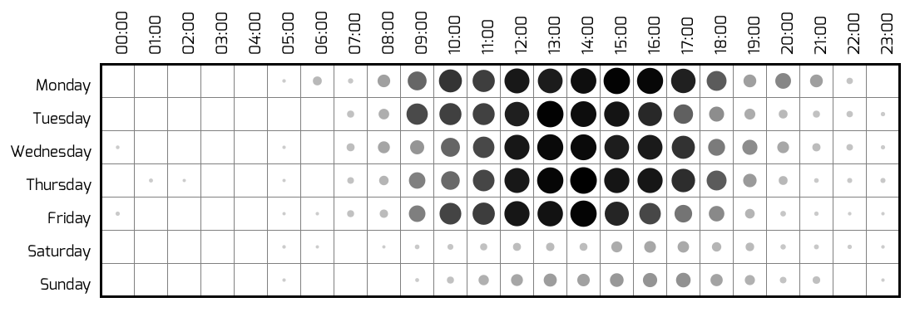

# Bürostats - Statistics From Our Office



This projects evaluates the data gathered by the light sensor in our office and punches them into a card.
The intention behind this is to give folks, who want to visit us in our office, a recommendation on how likely it is that somebody will be there, since we don't have strict office hours.
These statistics pose as an addition to the [Buerostatus](https://github.com/fsr/buerostatus) project, which gathers the data and gives live feedback on our [website](https://ifsr.de).


## Dependencies

Since this project uses the [Punchcard module](https://github.com/fogleman/Punchcard) from **fogleman** (unfortunately a Python 2 project), you will need py2cairo, pango and pygtk.
On OS X, those can be installed using _Homebrew_:  
```
$ brew install py2cairo pango pygtk
```

Additionally, you can install the required pip modules, using:  
```
$ pip install -r requirements.txt
```

To render the punchcard correctly, the **[Exo](https://www.fontsquirrel.com/fonts/exo)** font needs to be installed on your system.


## Rendering the image

Render the image by running:  
```
$ python buerostats.py
```
This will generate a **punchcard.png** file inside the repository as output.


## Something fishy? Found a bug?

Don't hesitate to open an [Issue](https://github.com/fsr/stats/issues) if you found something that bothers you!
